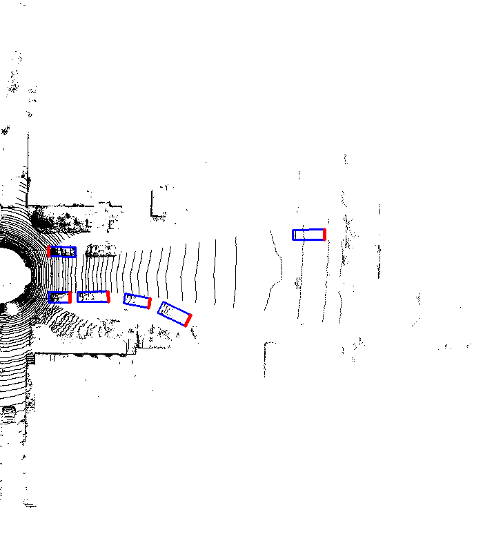
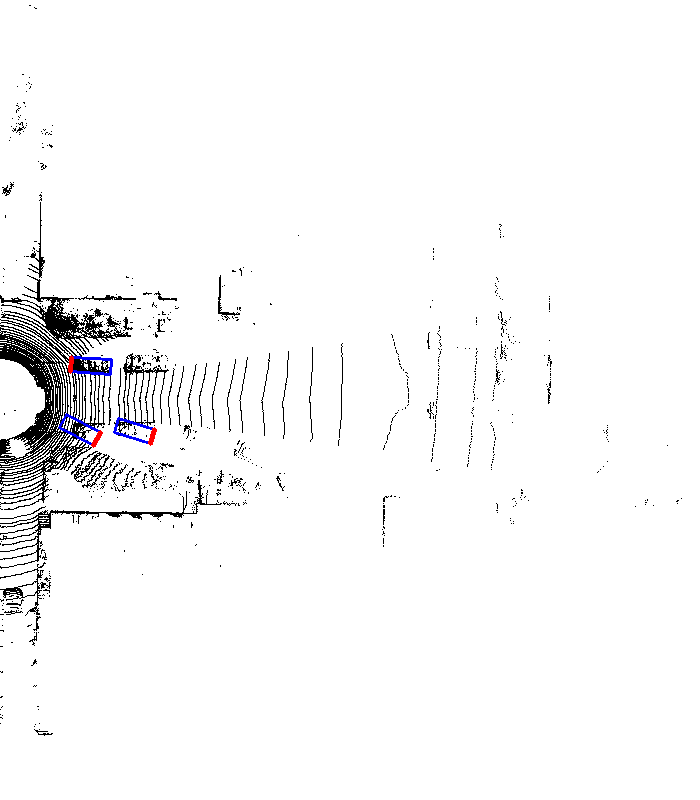

# PIXOR
Bird's Eye View Object Detection Algorithm for self-driving Cars

This is an **ongoing** attempt implement [PIXOR](http://openaccess.thecvf.com/content_cvpr_2018/CameraReady/3012.pdf) with PyTorch for Univerity of Toronto's self-driving team (aUToronto)

The repository now contains the code of the model archeitecuture, the loss function, the training script, visualizaiton scripts and dataset wrapper.

The following sample detection are the result of a network trained on a Nvidia GTX-1080Ti for 10 epochs with a batch size of 4.

Ground Truth

Predictions

Output of the final layer

Credits
Project Contributors

Philip Huang
Allan Liu
Paper Citation below

@inproceedings{yang2018pixor,
  title={PIXOR: Real-Time 3D Object Detection From Point Clouds},
  author={Yang, Bin and Luo, Wenjie and Urtasun, Raquel}
}
